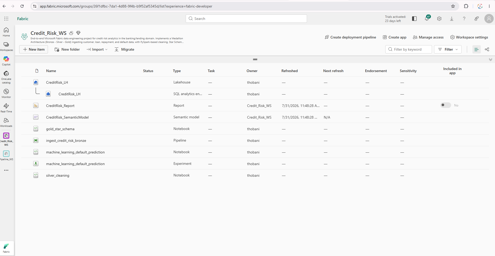
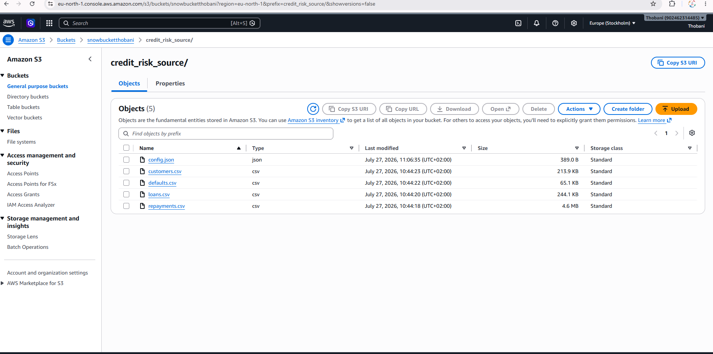
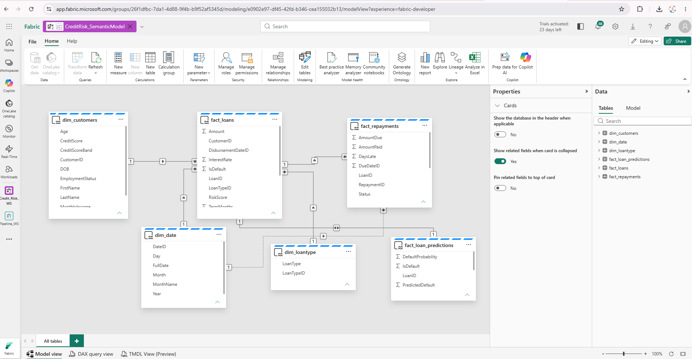
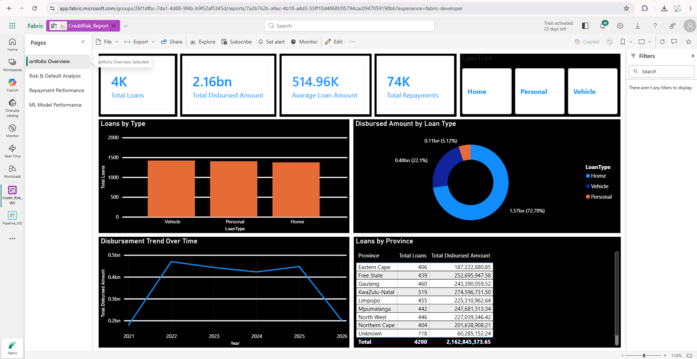
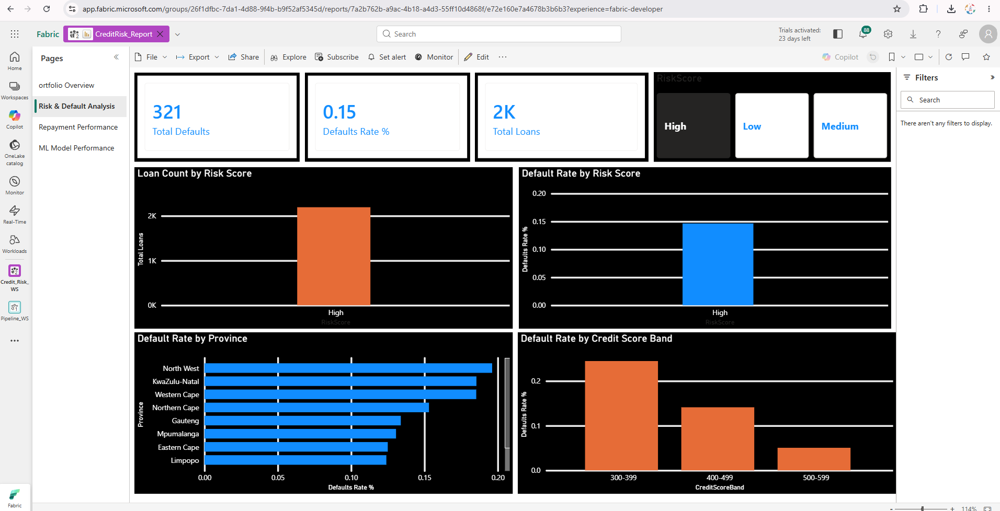
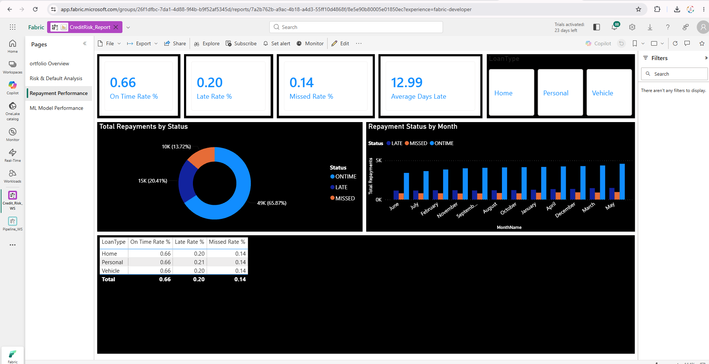
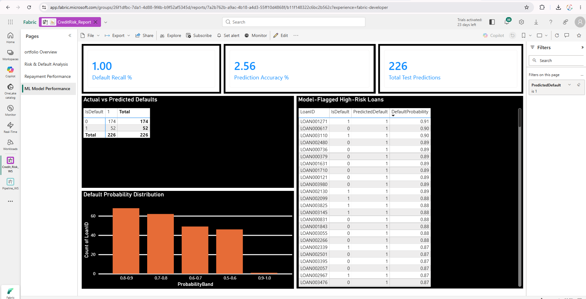

# Microsoft Fabric Credit Risk Analytics Pipeline

An end-to-end credit risk analytics pipeline built on Microsoft Fabric, ingesting synthetic South African banking data (customers, loans, repayments, defaults) from AWS S3 and delivering interactive risk and machine learning insights through Power BI.

## Table of Contents

- [Architecture](#architecture)
- [Pipeline Stages](#pipeline-stages)
- [Machine Learning](#machine-learning)
- [Tech Stack](#tech-stack)
- [Data Source](#data-source)
- [Repository Structure](#repository-structure)
- [Screenshots](#screenshots)
- [Key Findings](#key-findings)
- [Lessons Learned](#lessons-learned)
- [Author](#author)

## Architecture

```
AWS S3 (snowbucketthobani, eu-north-1)
        │  credit_risk_source/
        │  ├── config.json
        │  ├── customers.csv
        │  ├── loans.csv
        │  ├── repayments.csv
        │  └── defaults.csv
        │
        ▼  Metadata-driven Data Pipeline (Lookup → ForEach → Copy Data)
Microsoft Fabric — Credit_Risk_WS
        │
        ▼  CreditRisk_LH (Lakehouse)
   Bronze  →  governed Delta tables, dynamically named per source file
        │
        ▼  PySpark notebook
   Silver  →  cleaned, deduplicated, type-cast, referentially validated
        │
        ▼  PySpark notebook
   Gold    →  Star Schema (dimensions + facts), rule-based risk scoring
        │
        ▼  PySpark MLlib
   ML      →  Logistic Regression default classifier, predictions written back to Gold
        │
        ▼  Direct Lake mode
Power BI  →  4-page dashboard (Portfolio, Risk, Repayments, ML Performance)
```

**Ingestion pattern:** the pipeline (`ingest_credit_risk_bronze`) reads `config.json` via a Lookup activity, listing each source file and its key column. A ForEach loop then dynamically copies each file from S3 into its own Delta table under the `Bronze` schema, using the file name and key column from the config - meaning new source files can be added without changing the pipeline itself.

## Pipeline Stages

| Stage | Description | Tooling |
|---|---|---|
| Ingestion | Metadata-driven Copy Data pipeline, S3 - governed Delta tables | Fabric Data Pipeline, AWS S3 |
| Bronze | Raw ingested tables, one per source file | Fabric Lakehouse (`CreditRisk_LH`) |
| Silver | Multi-format date parsing, deduplication, null handling, referential integrity checks | PySpark |
| Gold | Star Schema (`dim_customers`, `dim_loantype`, `dim_date`, `fact_loans`, `fact_repayments`), rule-based `RiskScore` and `CreditScoreBand` | PySpark, Delta Lake |
| Machine Learning | Logistic Regression default classifier, trained on Gold layer features | PySpark MLlib |
| Serving | Semantic model built directly on Gold via Direct Lake (zero data duplication) | Power BI Direct Lake |
| Reporting | 4-page interactive dashboard with button slicers and drill-through | Power BI, DAX |

## Machine Learning

A Logistic Regression classifier predicts loan default risk from customer and loan features (credit score, income, age, loan amount, interest rate, term, loan type).

**Key challenge - class imbalance:** With only ~7.8% of loans defaulting, an unweighted model achieved 91.9% accuracy simply by predicting "no default" for every single loan - a dangerous, common failure mode in credit risk modelling, since it would let every genuinely risky loan through undetected with zero warning.

**Fix - weighted logistic regression:** defaults were weighted 10x higher than non-defaults during training, explicitly penalizing the model for missing a real default far more than for a false alarm on a safe loan. This reflects the actual cost asymmetry in lending risk.

**Result:**

| Metric | Unweighted model | Weighted model |
|---|---|---|
| Accuracy | 91.9% | ~75.9% |
| Recall (defaults correctly caught) | 0% | ~83.9% |

Accuracy dropped, but recall - the metric that actually matters for catching risky loans - improved from 0% to ~84%, at the cost of a controlled increase in false positives. Predictions, including a per-loan default probability, are written back to `gold.fact_loan_predictions` and visualized in the dashboard's ML Model Performance page.

## Tech Stack

- **Storage:** AWS S3 (raw source)
- **Lakehouse / Compute:** Microsoft Fabric (Lakehouse, PySpark notebooks, Delta Lake)
- **Ingestion pattern:** Metadata-driven Fabric Data Pipeline (Lookup + ForEach + Copy Data)
- **Machine Learning:** PySpark MLlib (Logistic Regression, weighted classification)
- **Serving layer:** Power BI, Direct Lake mode
- **Modeling:** DAX measures for credit risk and model performance KPIs

## Data Source

Synthetic South African banking data was generated using Python and Faker (`data_generation/generate_synthetic_data.py`), intentionally including messy multi-format dates, duplicate records, and nulls to simulate real-world data quality issues for the Silver layer to resolve. The generated files (`data/`) were uploaded to the `snowbucketthobani` S3 bucket (eu-north-1) alongside a pipeline config file (`config/config.json`) mapping each file to its key column.

## Repository Structure

```
├── config/                          # Pipeline configuration (file → key column mapping)
├── data/                            # Synthetic source CSVs
├── data_generation/                 # Synthetic data generator script
├── notebooks/
│   ├── bronze/                      # Pipeline documentation (screenshots + README)
│   ├── silver/                      # Silver layer cleaning (PySpark)
│   ├── gold/                        # Gold layer Star Schema modelling (PySpark)
│   └── ml/                          # Default prediction model (PySpark MLlib)
└── docs/screenshots/                # Workspace and dashboard screenshots
```

## Screenshots

### Fabric Workspace Overview


### AWS S3 Source Bucket


### Semantic Model - Star Schema Relationships


### Power BI Dashboard

**Portfolio Overview**


**Risk & Default Analysis**


**Repayment Performance**


**ML Model Performance**


### Bronze Ingestion Pipeline
See [`notebooks/bronze/ingest_credit_risk_bronze/`](notebooks/bronze/ingest_credit_risk_bronze/) for pipeline configuration and run history screenshots.

## Key Findings

- Default rate varies sharply by credit score band, from ~25% (300-399) down to ~0% (700+), validating the synthetic risk model's realism.
- A weighted Logistic Regression model improved default recall from 0% to ~84% by explicitly addressing class imbalance - a materially more useful model for real lending risk than a naive high-accuracy baseline.
- Direct Lake mode enables near-real-time Power BI reporting directly on Delta tables with zero data duplication, though it comes with some current limitations around binning and calculated groups (see below).

## Lessons Learned

- **Direct Lake limitations:** features like "New group" (binning) and "Sort by column" aren't supported in Direct Lake mode from the Power BI web canvas. Where binning was needed (credit score bands, probability bands), the logic was moved upstream into PySpark as real Delta table columns instead.
- **Cross-region Git integration:** Fabric trial capacity (South Africa North) cannot connect to Azure DevOps organizations outside that region, and Azure DevOps has no South Africa geography option at all - an unresolvable platform limitation on trial accounts. Code was version-controlled by manually syncing notebook code to this GitHub repository instead of using Fabric's native Git integration.
- **Class imbalance in risk modelling:** a model can report misleadingly high accuracy while having zero real predictive value on the minority class it's meant to catch - a critical thing to check for, not just accuracy alone, in any risk/fraud modelling context.

## Author

**Thobani Zondi**
SQL Database Developer | Aspiring Data Engineer
[GitHub](https://github.com/thobanizondi) · [LinkedIn](https://linkedin.com/in/thobani-zondi) · [Portfolio](https://datascienceportfol.io/thobanizondi)


